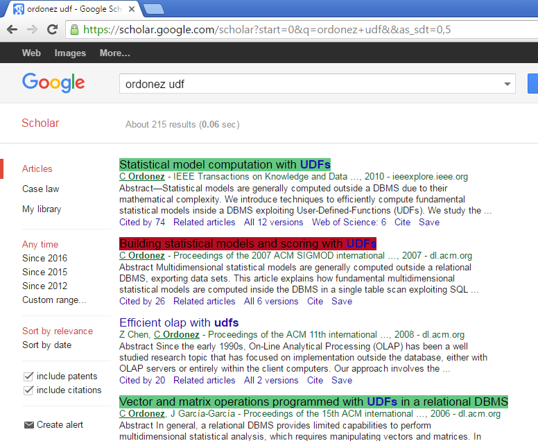

### About

While searching for publications it's quite important to know in advance which exact publications are already in your personal database and which are not. Current simple Google Chrome Extension allows to match your own publications database and searching results displayed by search engine (primary by Google Scholar)

### Usage

* Download git repo and open archive
* Install Google Chrome extension (install in "developer" mode as it show [here](http://lifehacker.com/install-chrome-extensions-from-outside-the-store-with-d-1596918011)
* Popular 'db.csv' file with your publications of the following format
```csv
"Fit or Unfit_Analysis and Prediction of _Closed Questions_ on Stack Overflow";"UNREAD"
"Hourly Traffic Prediction of News Stories";"UNREAD"
"Opinion mining and analysis_a survey";"UNREAD"
```
* Search your publications on Google Scholar (or any in other online library, requires adaptation of HTML parsing)
* Click on "Highlight Publications"
* Enjoy

### Sample highlighting output



### Used Libraries and Plugins

* [jQuery](https://jquery.com/)
* [jQuery-Tabledit](https://github.com/markcell/jquery-tabledit)

### Credits

Base on Google Chrome extension [Find-Many-Strings](https://github.com/psankar/Find-Many-Strings), which is distributed under MIT license.

###  License

The MIT License (MIT)

Details in [license](LICENSE) file.
